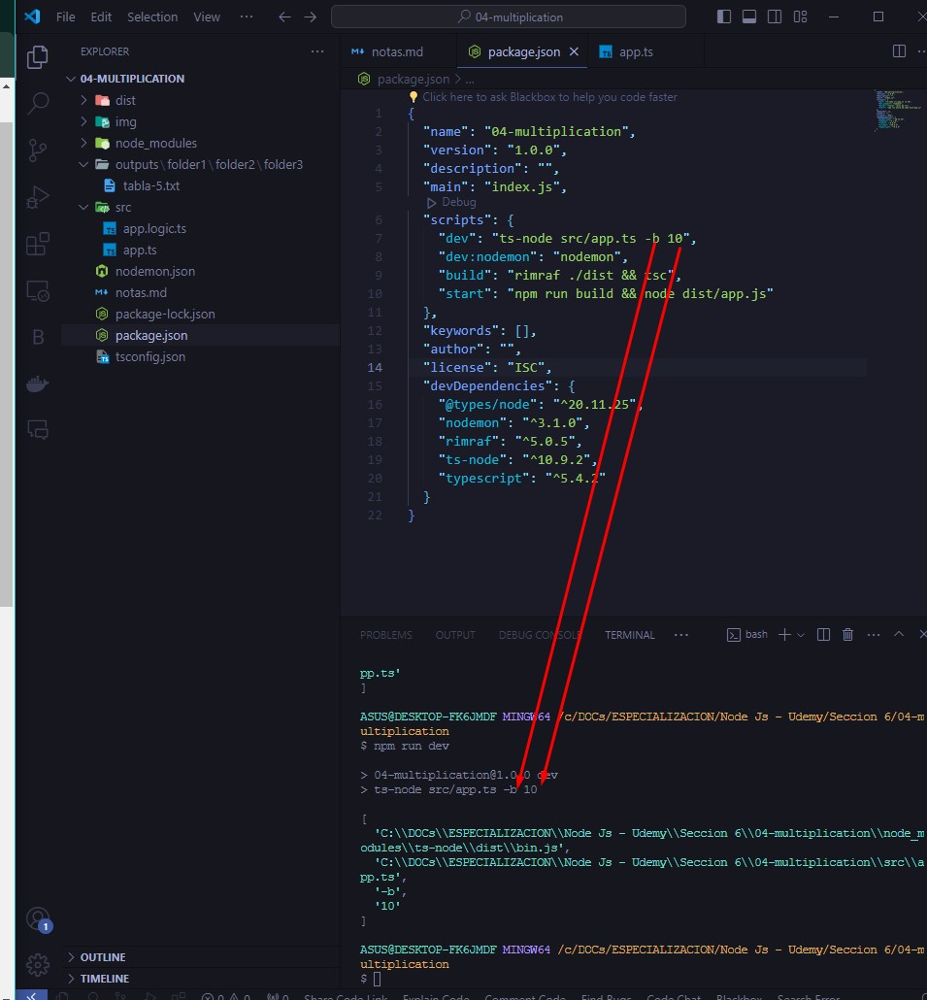
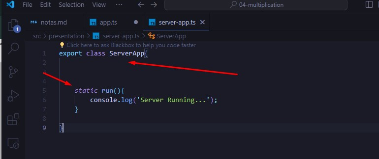
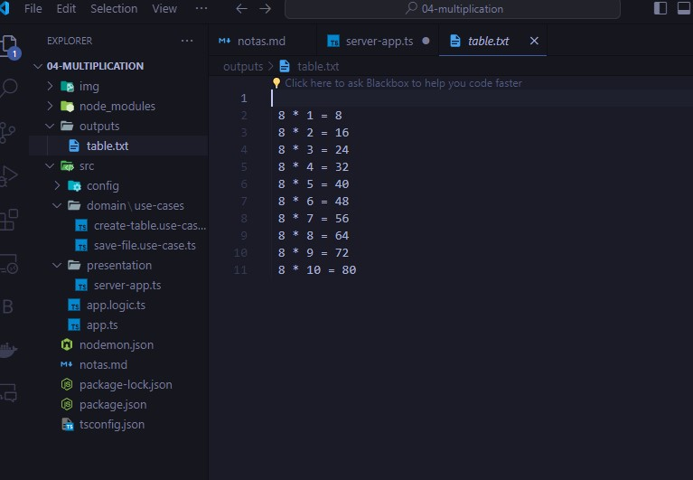
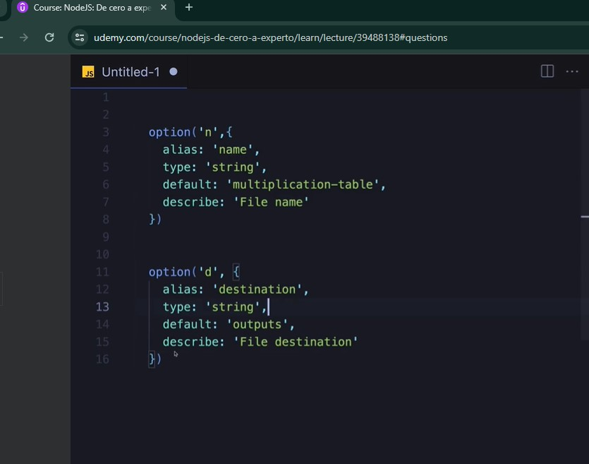

# Sección 6: Aplicación de consola - Clean Architecture - Primeros Pasos

* Pasos:
[Node con TypeScript - Recomendado](https://gist.github.com/Klerith/47af527da090043f604b972b22dd4c01)

1. Instalar TypeScript y demás dependencias
```
npm i -D typescript @types/node ts-node nodemon rimraf
```
2. Inicializar el archivo de configuración de TypeScript ( Se puede configurar al gusto)
```
npx tsc --init --outDir dist/ --rootDir src
```
3. Crear archivo de configuración Nodemon - nodemon.json
```
{
  "watch": ["src"],
  "ext": ".ts,.js",
  "ignore": [],
  "exec": "npx ts-node ./src/app.ts"
}
```
4. Crear scripts para dev, build y start
```
 "dev": "nodemon",
  "build": "rimraf ./dist && tsc",
  "start": "npm run build && node dist/app.js"
```


## Tarea - Impresión de consola y archivo

* Ejercicio con fs - filesystem


* Creando el directorio de salida:


##  Argv - Argument Values


*Banderas





## yargs
[npm yargs](https://www.npmjs.com/package/yargs)
[web oficial yargs](https://yargs.js.org/)

* Instalando:

* Opciones:


* Uso en el proyecto:


## Función anónima auto-invocada


## Opciones de Yargs


## Checks - Validaciones adicionales


## Usando Yargs empiricamente


## Refactorizar - Organizar lógicamente el código
* Buenas prácticas 



## Clean Architecture - Use Cases


## CreateTable - UseCase
* La idea del directorio "domain" es que allí se tendrán las reglas que van a regir a otras capas exteriores


## SaveFile - UseCase





## Tarea y Solución



